# Complete Workflow Guide

This guide walks you through every step of the RRational workflow — from opening the app to exporting publication-ready HRV results.

---

!!! success "Recommended: Scientific Workflow (Quigley 2024)"
    This workflow follows professor-reviewed best practices:

    1. **Import** → Load data and verify participant detection
    2. **Inspect** → Visual tachogram review for each participant
    3. **Segment** → Time-based segmentation (5 min windows)
    4. **Detect** → Run artifact detection on **all validated sections**
    5. **Assess** → Per-segment quality grading — exclude segments with >10% artifacts
    6. **Analyze** → HRV metrics on clean, assessed segments
    7. **Report** → Always include: beat count, artifact rate, quality grade

---

## Step 1: Launch & Create a Project

### 1.1 Start RRational

```bash
uv run streamlit run src/rrational/gui/app.py
```

The app opens at [http://localhost:8501](http://localhost:8501). You'll see the Data tab as the landing page.

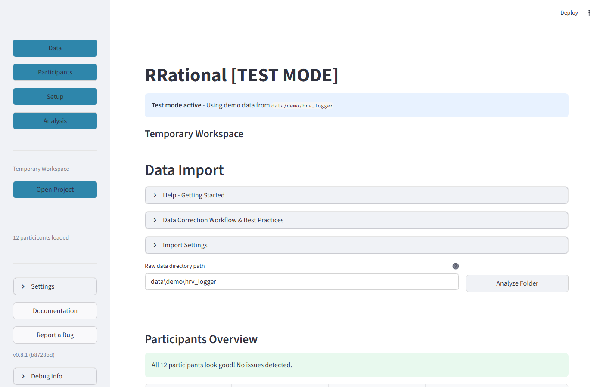

*What you see: The **Data Import** page with three expandable help sections at the top ("Help - Getting Started", "Data Correction Workflow & Best Practices", "Import Settings"). Below is the **Raw data directory path** input field and the **"Analyze Folder"** button. In the sidebar (left): navigation buttons, project info, and at the bottom: Settings, Documentation, and Report a Bug.*

**Sidebar buttons explained:**

| Button | What it does |
|--------|-------------|
| **Data / Participants / Setup / Analysis** | Switch between the four main tabs |
| **Open Project** (or **Switch Project**) | Open or switch to a different project |
| **Settings** | Expand to change plot resolution, colors, and data folder |
| **Documentation** | Opens the RRational documentation website |
| **Report a Bug** | Opens GitHub Issues to file a bug report |

**Data tab buttons explained:**

| Button / Element | What it does |
|--------|-------------|
| **Analyze Folder** | Scans the raw data directory and loads all participant recordings |
| **Help - Getting Started** | Expandable section with usage instructions |
| **Data Correction Workflow** | Expandable section explaining the recommended correction pipeline |
| **Import Settings** | Expandable section to configure ID patterns, file formats, and import options |

### 1.2 Create a Project

On the Welcome Screen (or via "Open Project" in the sidebar):

1. Click **"Create New Project"**
2. Click **"Browse"** → choose a folder (e.g., `Documents/HRV_Studies/`)
3. Enter a **project name** (e.g., `MyStudy`)
4. Select **data sources**: HRV Logger, VNS Analyse, or both
5. Click **"Create Project"**

!!! tip "Copy your data first"
    Copy your HRV recording files into the `data/raw/hrv_logger/` or `data/raw/vns/` subfolder **before** clicking "Analyze Folder".

---

## Step 2: Import Data (Data Tab)

### 2.1 Load Recordings

1. Verify the **Raw data directory path** points to your `data/raw/` folder
2. Click **"Analyze Folder"**
3. Wait for the scan to complete

### 2.2 Participants Overview

After loading, scroll down to the **Participants Overview**:


*What you see: A green success bar ("All 12 participants look good!") followed by the participant table. Each row shows one participant with columns for: **Participant** (ID), **CSV** (import status), **Quality** ([OK] or warnings), **Saved** (Y/N), **App** (HRV Logger or VNS Analyse), **Device** (e.g., Polar H10), **Files** (number of RR/Events files), **Date/Time** (recording timestamp), **Group** (editable), **Total Beats**, **Retained**, **Duplicates**, **Artifacts (%)**, and **Duration (min)**.*

**Table columns explained:**

| Column | Meaning |
|--------|---------|
| **Participant** | Auto-extracted ID from filename (e.g., `0001CTRL`) |
| **Quality** | `[OK]` = no issues, warnings indicate problems |
| **Saved** | `Y` = events have been saved to disk |
| **Total Beats** | Total number of RR intervals in the recording |
| **Retained** | Beats remaining after duplicate removal |
| **Group** | Study group — editable directly in the table |

### 2.3 Below the Table


*Below the table you'll find two buttons and a tip:*

| Button | What it does |
|--------|-------------|
| **Download Participants CSV** | Downloads the participant table as a CSV file for external use |
| **Import Group/Sequence from CSV** | Opens an expandable section to bulk-import group and sequence assignments from a study master CSV |

---

## Step 3: Review Participants (Participants Tab)

Click **"Participants"** in the sidebar.

### 3.1 Participant Header

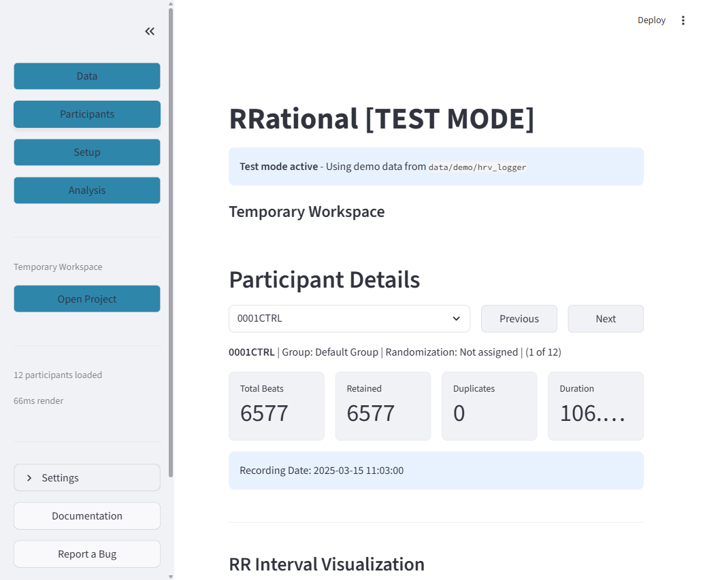

*What you see: A **dropdown** to select a participant (e.g., "0001CTRL"), **Previous** and **Next** buttons for navigation, a summary line ("Group: Default Group | Randomization: Not assigned | 1 of 12"), and four **metric cards**.*

**Metric cards explained:**

| Card | Meaning |
|------|---------|
| **Total Beats** | Total RR intervals in the recording |
| **Retained** | Beats kept after duplicate removal |
| **Duplicates** | Number of duplicate timestamps removed |
| **Duration** | Total recording duration in minutes |

### 3.2 Mode Selector & Plot Options

Below the metrics, you'll see the interaction modes and plot settings:

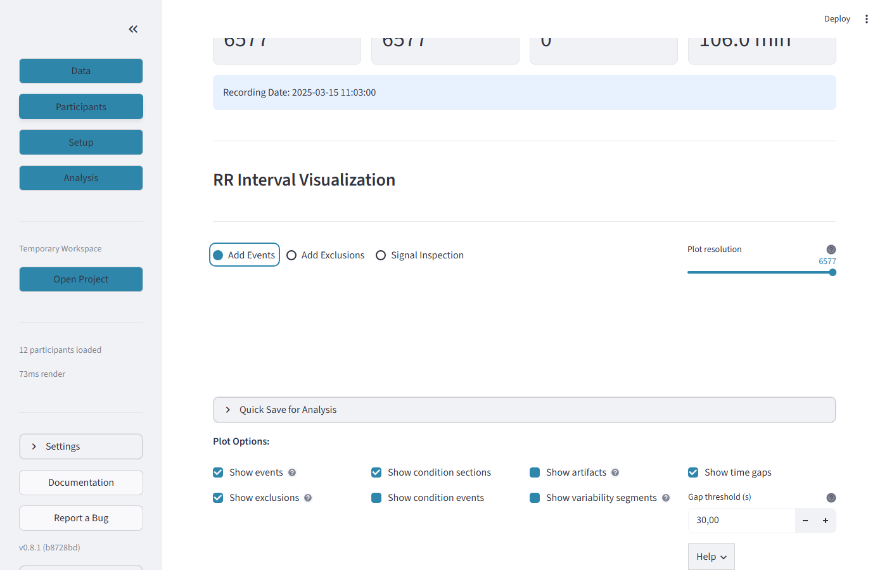

*What you see: The **RR Interval Visualization** heading, three **mode buttons** ("Add Events", "Add Exclusions", "Signal Inspection"), a plot resolution selector, and the **"Quick Save for Analysis"** expander. Below are the **Plot Options** checkboxes.*

**Mode buttons explained:**

| Mode | What it does |
|------|-------------|
| **Add Events** | Click anywhere on the tachogram to add a new event marker at that timestamp |
| **Add Exclusions** | Click two points on the tachogram to mark a time range for exclusion from analysis |
| **Signal Inspection** | Enables detailed artifact inspection with zoom and pan capabilities |

**Plot Options checkboxes:**

| Checkbox | What it shows/hides |
|----------|-------------------|
| **Show events** | Vertical dashed lines at event timestamps (measurement start, pause, etc.) |
| **Show condition sections** | Colored background regions for repeating experimental conditions |
| **Show artifacts** | Orange markers for detected artifacts — **also reveals the Detect New Artifacts expander** |
| **Show time gaps** | Gray shading for recording interruptions (HRV Logger only) |
| **Show exclusions** | Red shading for manually excluded time ranges |
| **Show condition events** | Individual start/end event markers for conditions |
| **Show variability segments** | Color-coded regions indicating local variability (green=stable, orange=moderate, red=high) |

**Other controls:**

| Control | What it does |
|---------|-------------|
| **Gap threshold (s)** | Minimum gap duration (in seconds) to display. Default: 30s |
| **Help** | Dropdown with explanation of keyboard shortcuts and interaction modes |
| **Refresh** | Reloads the current participant's data and redraws the plot |
| **Quick Save for Analysis** | Expander to save artifact markings without full export |

### 3.3 The Tachogram

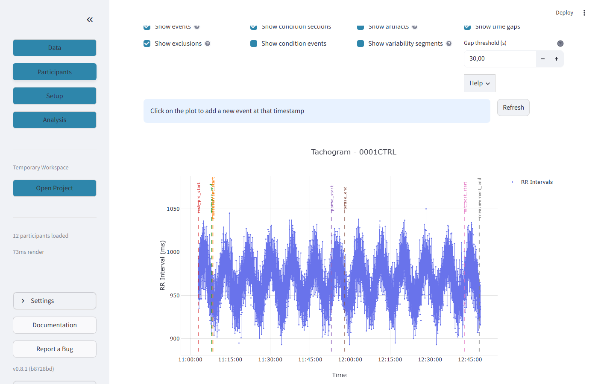

*What you see: The tachogram plot with **RR intervals (ms)** on the Y-axis and **time** on the X-axis. The **blue line** traces the heart rhythm. **Vertical dashed lines** mark events. **Orange dots** are detected artifacts. The plot title shows "Tachogram - 0001CTRL" and the legend identifies "RR Intervals".*

*What to look for:*

- **Regular oscillations** in the blue line = normal respiratory sinus arrhythmia
- **Flat lines or sudden jumps** = potential artifacts or movement
- **Orange dots** = detected ectopic, missed, or extra beats
- **Dashed vertical lines** = event markers (measurement start, pause, etc.)

---

## Step 4: Artifact Detection

!!! info "Why artifacts matter"
    Even a small number of artifacts can dramatically distort HRV metrics. Always detect and assess artifacts before analysis.

### 4.1 Enable Artifacts

1. Check the **"Show artifacts"** checkbox in Plot Options
2. This reveals the **"Detect New Artifacts"** expander below the plot

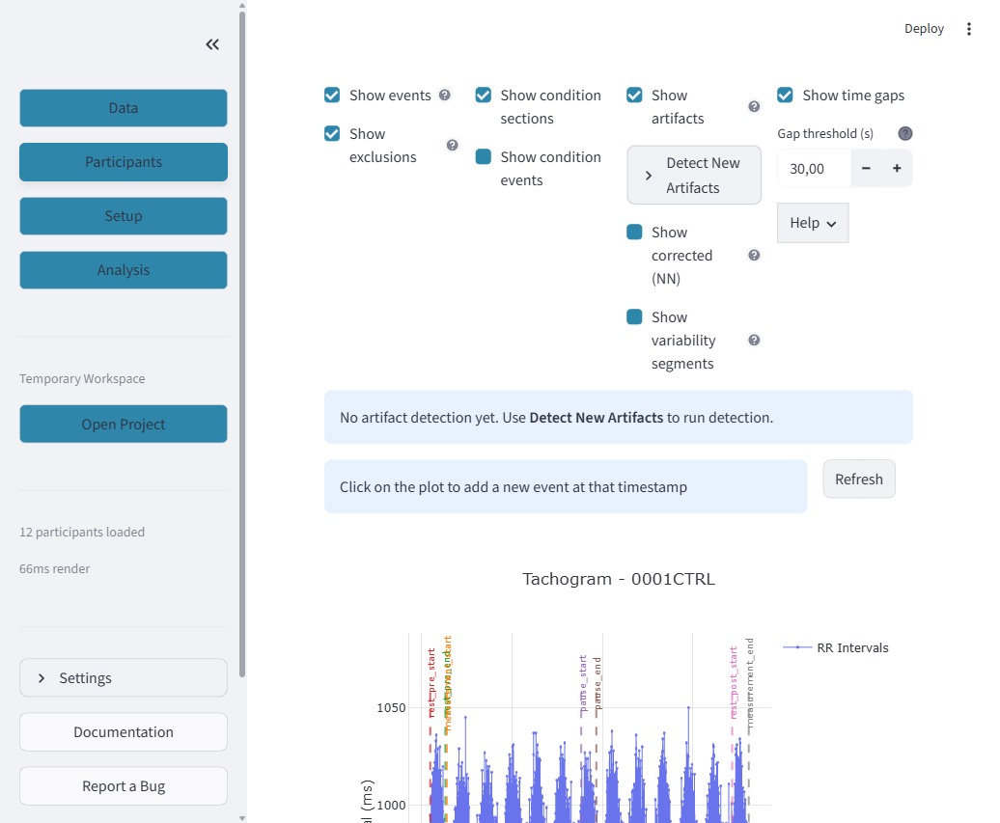

*After enabling "Show artifacts", orange markers appear on the tachogram showing where the algorithm detected problematic beats.*

### 4.2 Artifact Detection Settings

Expand **"Detect New Artifacts"** to configure detection:

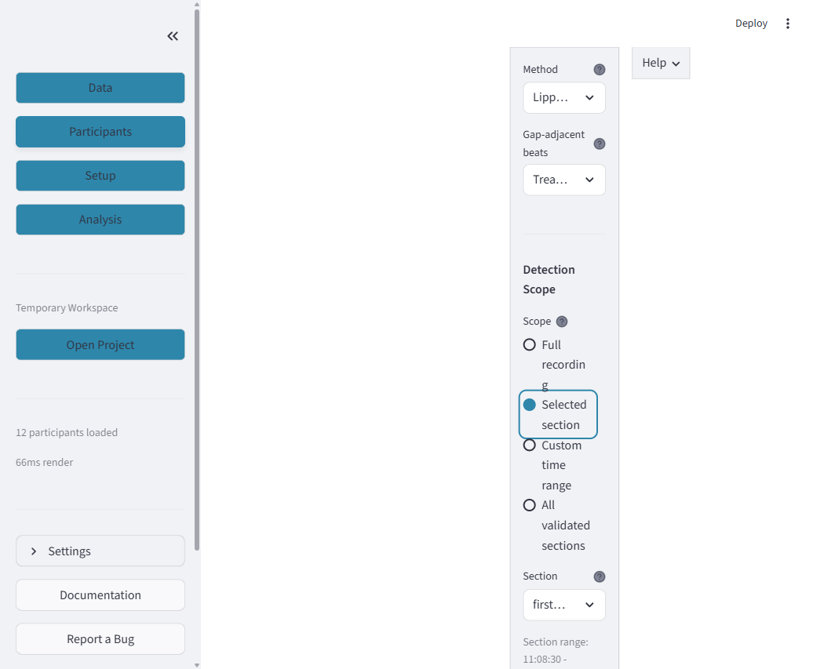

*What you see: The detection panel with Method, Gap handling, Detection Scope, Section selector, and Segment Sizing options.*

**Settings explained:**

| Setting | Options | Recommended |
|---------|---------|-------------|
| **Method** | Lipponen 2019 (segmented) | **Lipponen 2019** — current gold standard |
| **Gap-adjacent beats** | Treat as segment boundaries / Include in detection | **Treat as segment boundaries** — prevents false positives near gaps |
| **Detection Scope** | Full recording / Selected section / Custom time range / All validated sections | **All validated sections** — ensures same segments for detection and analysis |
| **Segment Sizing** | Adaptive / Preset / Manual | **Adaptive** — automatically calculates optimal window size |

### 4.3 Detection Scope

The Detection Scope is critical for the scientific workflow:

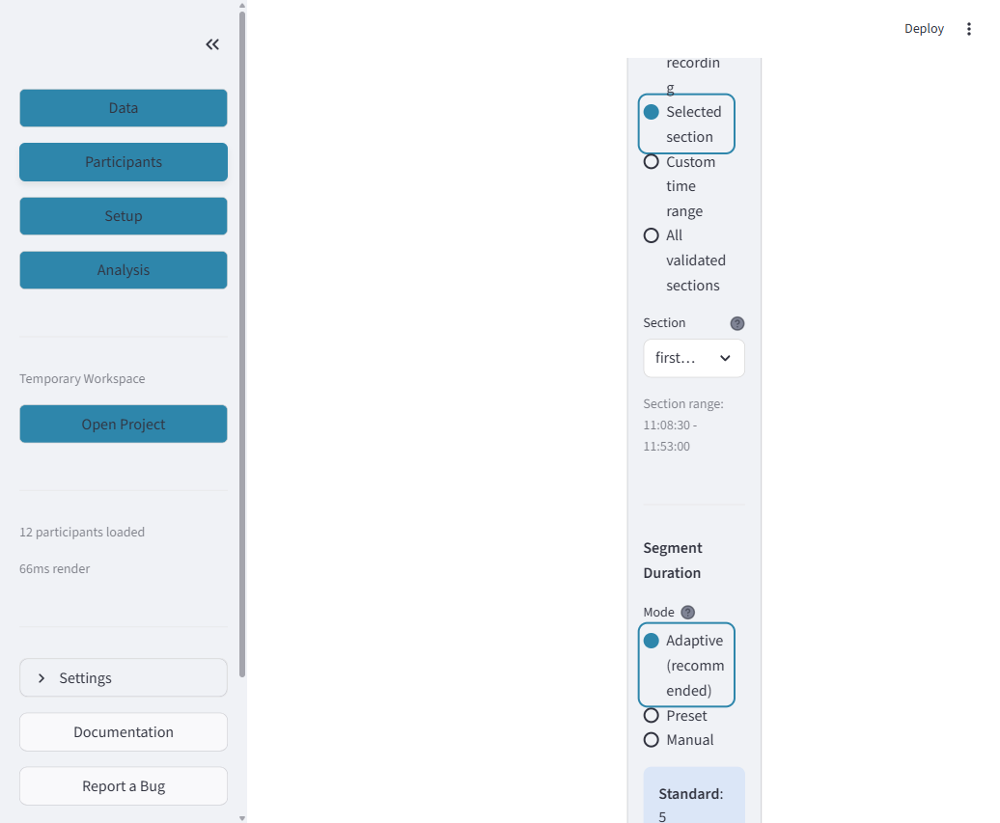

*What you see: Four radio buttons for scope selection, a section dropdown (when "Selected section" is chosen), and the time range display.*

| Scope | What it does | When to use |
|-------|-------------|-------------|
| **Full recording** | Detects across the entire recording | Quick overview, exploratory analysis |
| **Selected section** | Detects within one specific section | When you only need one section |
| **Custom time range** | Manual start/end time selection | For unusual recording structures |
| **All validated sections** | Detects separately for each validated section | **Recommended** — scientific workflow |

### 4.4 Run Detection

Click **"Run Detection"** and review the results.

### 4.5 Section Validation & Data Integrity

Scroll down to see the **Section Validation** results:

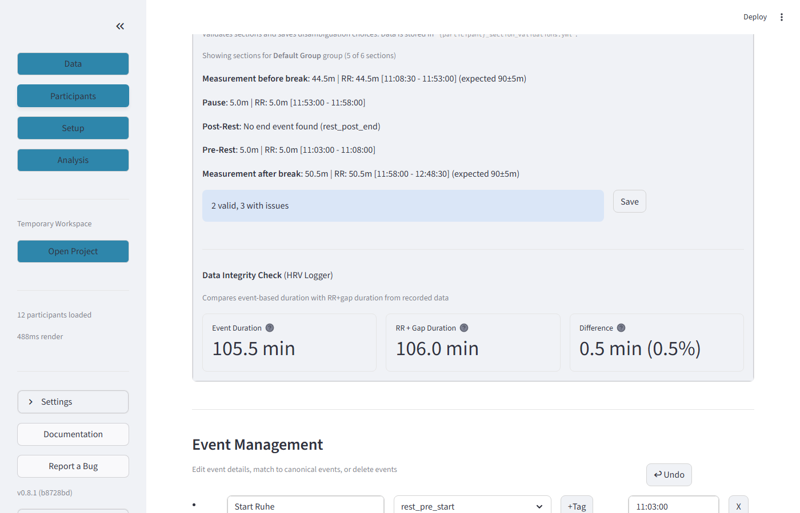

*What you see: Each defined section with its validation status. For this participant: "Measurement before break" (44.5 min), "Pause" (5.0 min), "Post-Rest" (no end event found), "Pre-Rest" (5.0 min), "Measurement after break" (50.0 min). The summary shows "2 valid, 3 with issues" and a **Save** button.*

**Section validation indicators:**

| Indicator | Meaning |
|-----------|---------|
| **Bold section name + duration** | Section is valid, events found |
| **"No end event found"** | End event is missing — section cannot be analyzed |
| **"expected X±Ym"** | Shows expected duration with tolerance |
| **2 valid, 3 with issues** | Summary of validation results |

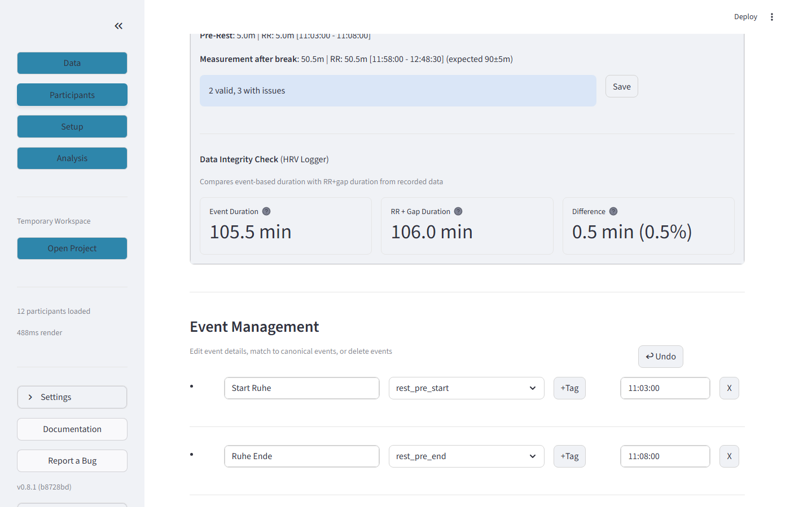

*Below the section list, the **Data Integrity Check** compares: **Event Duration** (from event timestamps: 105.5 min) vs **RR+Gap Duration** (from summing all RR intervals and gaps: 106.0 min). The **Difference** (0.5 min, 0.5%) should be small — large differences indicate data corruption.*

### 4.6 Event Management

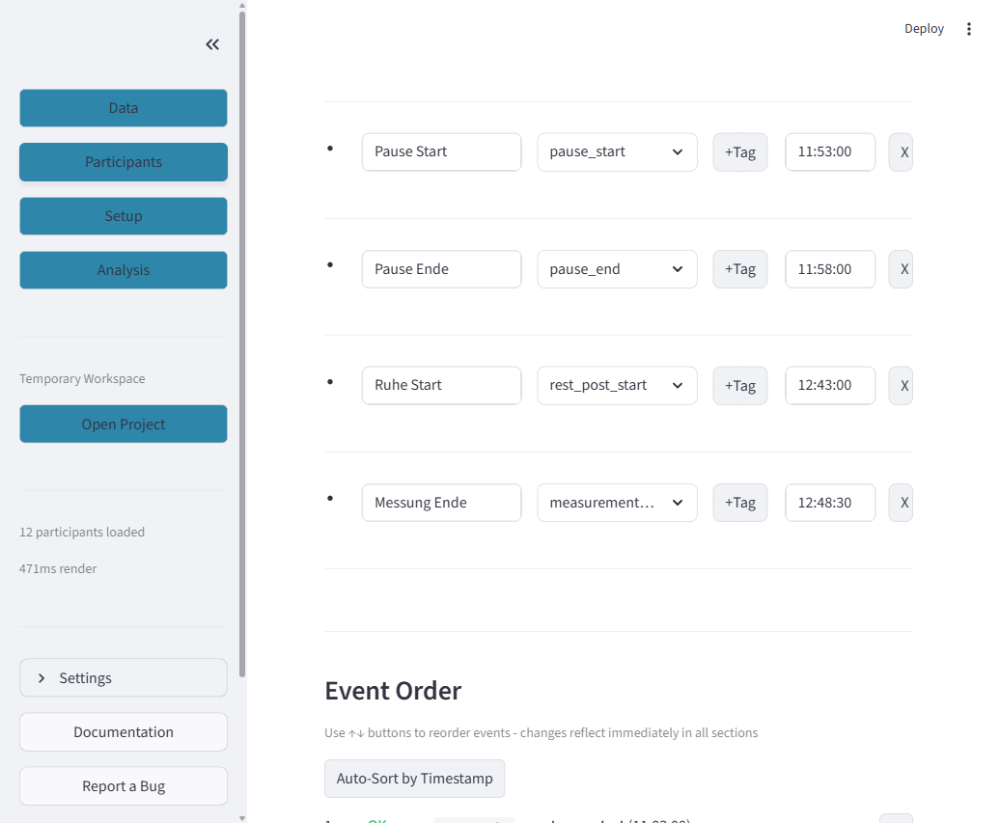

*What you see: The **Event Management** section where you can edit, reorder, or delete events. Each event row shows: a drag handle (bullet), the **raw label** (e.g., "Start Ruhe"), the **canonical name** dropdown (e.g., "rest_pre_start"), a **+Tag** button, and the **timestamp** (e.g., "11:03:00"). The **X** button deletes an event.*

### 4.7 Event List Detail

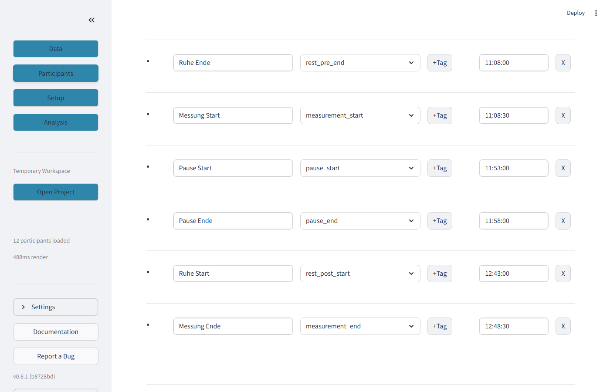

*Each event in the list has:*

| Element | What it does |
|---------|-------------|
| **Raw label** (left text field) | The original event name from the recording file (e.g., "Ruhe Ende") |
| **Canonical name** (dropdown) | The standardized event name (e.g., "rest_pre_end") — used for section matching |
| **+Tag** button | Add a tag/label to this event |
| **Timestamp** (right field) | The event time (HH:MM:SS) |
| **X** button | Delete this event |

### 4.8 Event Mapping Status


*The **Event Mapping Status** table shows which expected events were detected. **"Found"** (green) means the event was matched. **"Missing"** (red) means no matching event exists — you may need to add it manually or update synonyms in Setup > Events.*

| Button | What it does |
|--------|-------------|
| **Save Events** | Persist all event changes to disk |
| **Reset to Original** | Undo all manual changes and restore original events |

### 4.9 Export for Analysis

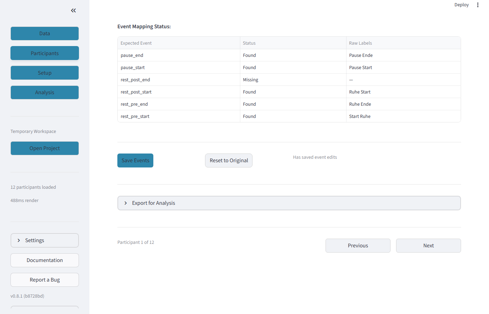

*The **Export for Analysis** section saves a `.rrational` file containing corrected RR intervals, artifact indices, quality metrics, and a full audit trail. This file can be reloaded in the Analysis tab.*

!!! success "Quality Grading (Quigley 2024)"
    | Grade | Artifact Rate | Action |
    |-------|--------------|--------|
    | **Excellent** | <2% | Include as-is |
    | **Good** | 2-5% | Include, apply correction |
    | **Fair** | 5-10% | Include with caution |
    | **Poor** | >10% | **Exclude from analysis** |

---

## Step 5: Configure Study (Setup Tab)

Click **"Setup"** in the sidebar. Four sub-tabs are available via radio buttons: **Events**, **Groups**, **Sequences**, **Sections**.

### 5.1 Events

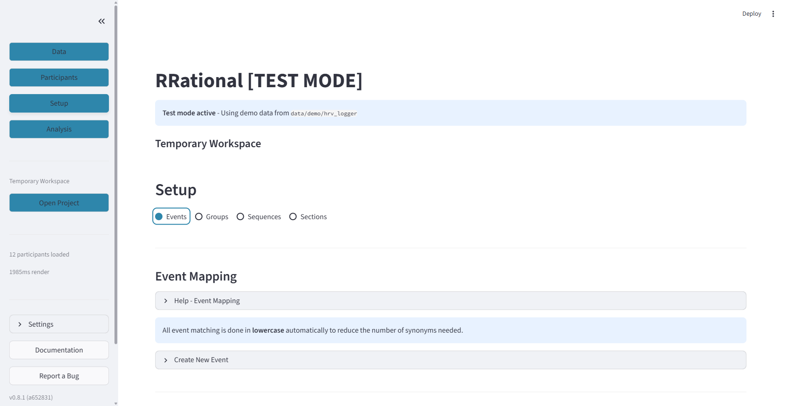

*What you see: The **Events** sub-tab (selected in the radio buttons). The "Event Mapping" section with a help expander, an info bar about case-insensitive matching, and a "Create New Event" expander.*

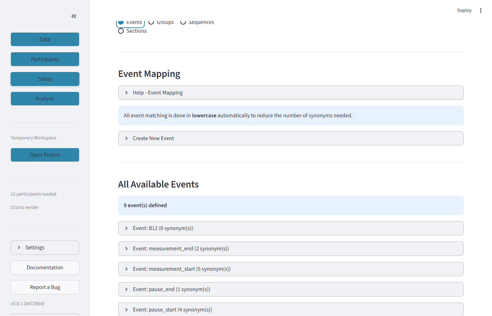

*Scrolling down reveals the event definitions table. Each event has a **canonical name** (e.g., `measurement_start`), **synonyms** for fuzzy matching (comma-separated), and a **regex pattern** for advanced matching.*

| Button | What it does |
|--------|-------------|
| **Create New Event** | Add a new canonical event name with synonyms |
| **Save Event Changes** | Persist all changes to the event configuration |
| **Download Events CSV** | Export event definitions as CSV |

### 5.2 Groups

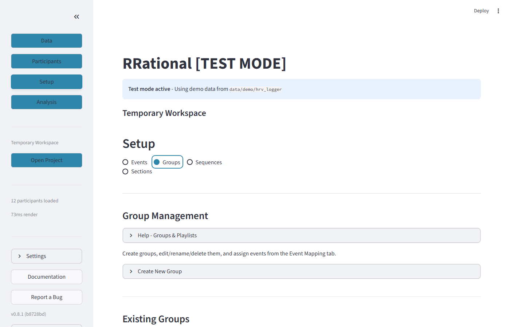

*What you see: The **Groups** sub-tab showing "Group Management". A help expander explains groups. Below is "Create New Group" and a list of existing groups.*

| Button | What it does |
|--------|-------------|
| **Create New Group** | Add a new study group (e.g., "control", "experimental") |
| **Save Changes** | Save group label and event assignments |
| **Delete** | Remove a group (does not delete participant data) |

### 5.3 Event Sequences

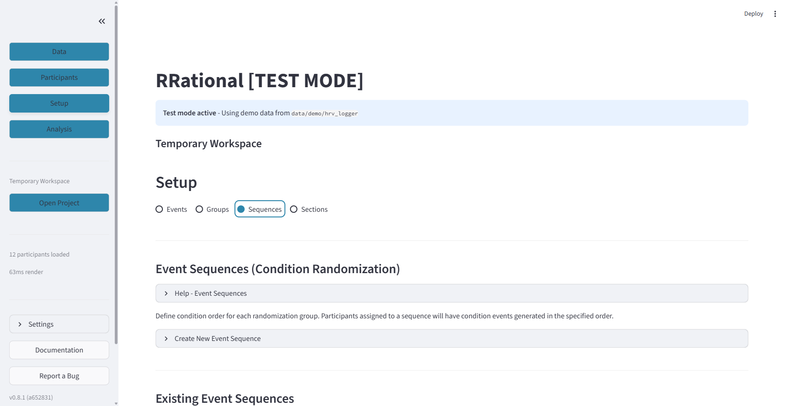

*What you see: The **Sequences** sub-tab showing "Event Sequences (Condition Randomization)". This is where you define the order of repeating conditions for randomization studies.*

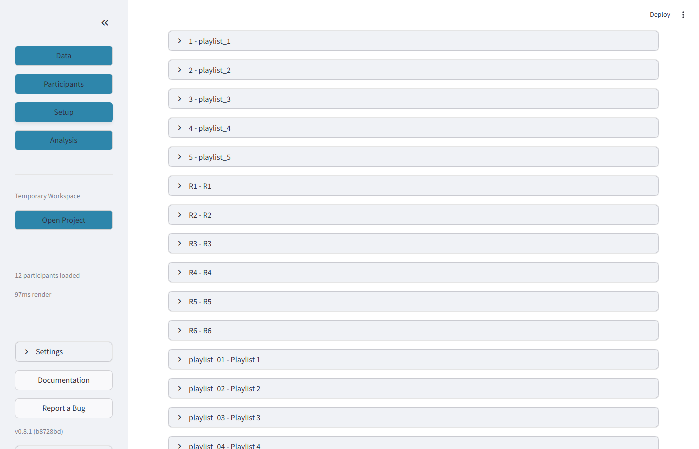

*Each sequence shows its **label**, **condition order** as arrows (e.g., "music_1 → music_2 → music_4 → music_3"), and buttons to edit or delete. Participants assigned to this sequence are listed below.*

| Button | What it does |
|--------|-------------|
| **Create Event Sequence** | Add a new sequence with condition order |
| **Save Changes** | Update label and condition order |
| **Delete** | Remove the sequence and unassign participants |

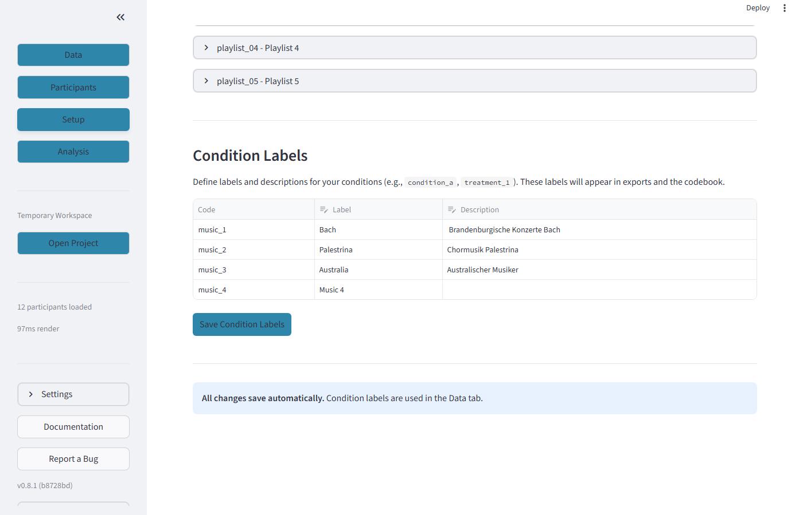

*Below the sequences, the **Condition Labels** table lets you define display names. For example, internal code "music_1" can be labeled "Bach" with description "Brandenburgische Konzerte Bach".*

| Button | What it does |
|--------|-------------|
| **Save Condition Labels** | Persist label and description changes |

### 5.4 Sections

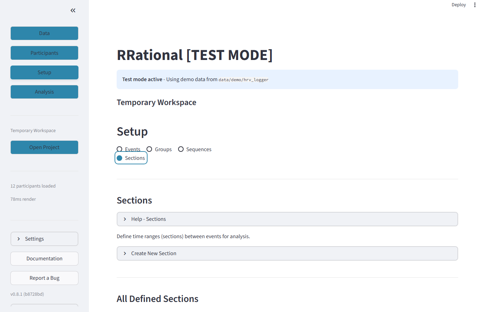

*What you see: The **Sections** sub-tab where you define analysis time windows. Each section has a Code, Label, Start/End Event(s), expected Duration, and Tolerance.*

| Field | What it means |
|-------|--------------|
| **Code** | Internal identifier (e.g., `baseline`) |
| **Label** | Display name (e.g., "Baseline Rest") |
| **Start Event(s)** | Comma-separated event names that start this section |
| **End Event(s)** | Comma-separated event names that end this section (first match wins) |
| **Duration (min)** | Expected duration for validation |
| **Tolerance (min)** | How much the actual duration may deviate |

---

## Step 6: Analyze HRV (Analysis Tab)

Click **"Analysis"** in the sidebar.

### 6.1 Choose Analysis Mode

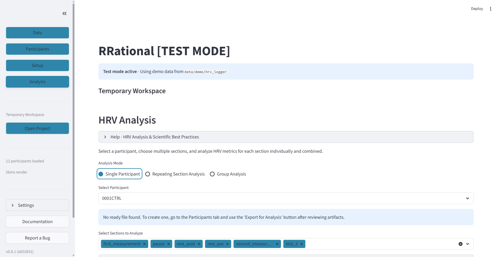

*What you see: Three radio buttons for analysis mode, a participant selector, and a section multiselect. The available sections are pre-selected based on validation.*

| Mode | What it does | When to use |
|------|-------------|-------------|
| **Single Participant** | Analyze one participant's sections individually | Detailed per-participant analysis |
| **Repeating Section Analysis** | Protocol-based repeating condition comparison | Studies with repeating conditions (e.g., music, stimuli) |
| **Group Analysis** | Batch comparison across study groups | Group-level statistical comparisons |
| **Sequence Comparison** | Compare HRV across event sequences and conditions | Counterbalanced designs, condition-order effects |

### 6.2 Single Participant Settings

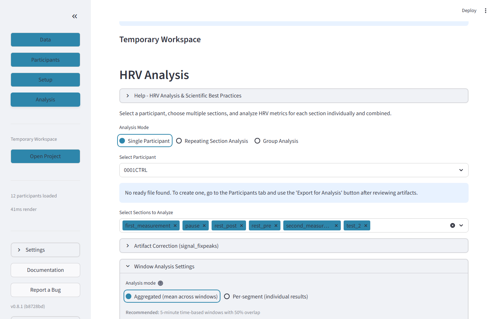

*What you see: Participant dropdown, section multiselect (all validated sections pre-selected), artifact correction expander, and analysis mode options (Aggregated vs Per-segment).*

| Setting | What it does |
|---------|-------------|
| **Select Participant** | Choose which participant to analyze |
| **Select Sections to Analyze** | Choose which sections to include (defaults to all validated) |
| **Artifact Correction** | Enable NeuroKit2 Kubios algorithm for artifact correction |
| **Aggregated** | One result per section (combines all windows) |
| **Per-segment** | Separate results for each time-based segment within a section |
| **Analyze HRV** | Run the analysis and show results |

### 6.3 Repeating Section Analysis

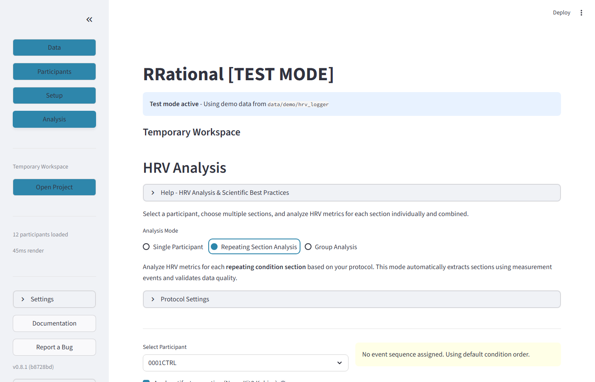

*What you see: The "Repeating Section Analysis" mode with Protocol Settings expander and participant/sequence selection. A warning appears if no event sequence is assigned.*

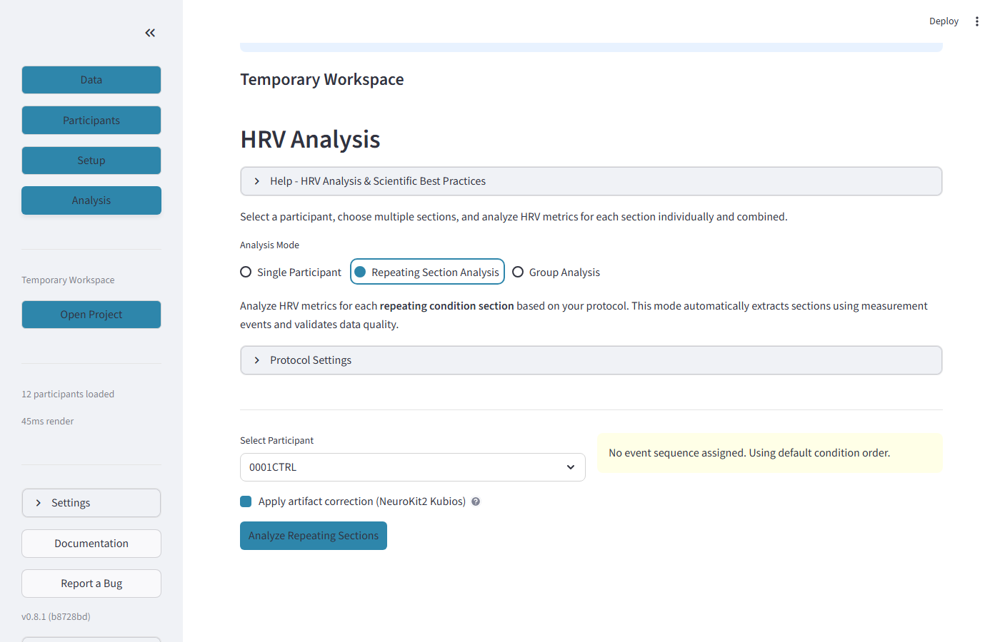

*The Protocol Settings define the expected recording structure: total duration, section length, number of pre/post-pause sections, minimum valid duration and beats, and how to handle duration mismatches.*

### 6.4 Group Analysis

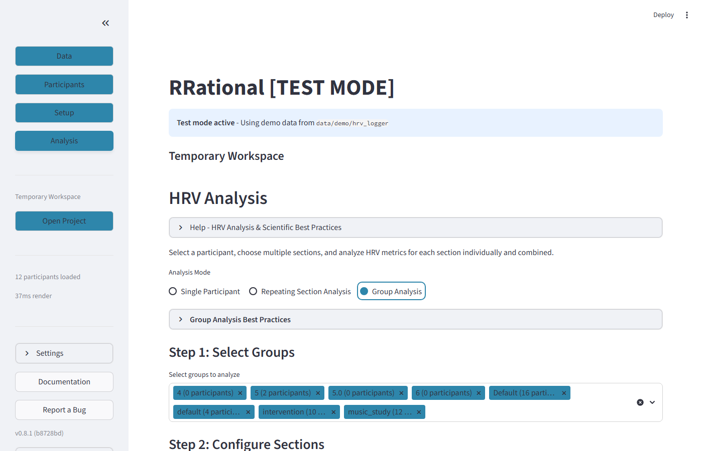

*What you see: Group Analysis mode where you select groups to compare and run batch analysis.*

### 6.5 Sequence Comparison

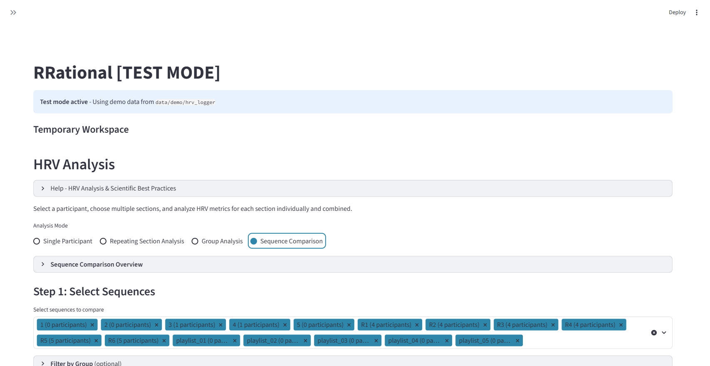

*What you see: The "Sequence Comparison" mode with all event sequences listed, showing participant counts per sequence. An optional "Filter by Group" expander allows cross-group comparisons.*

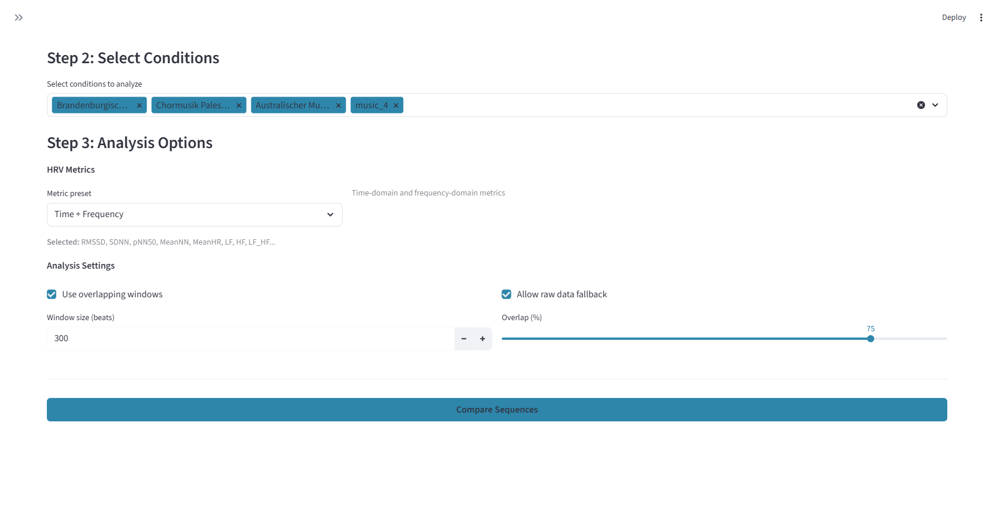

*Step 2 shows conditions to compare (extracted from sequence definitions). Step 3 provides the same metric presets and analysis settings as Group Analysis.*

| Setting | What it does |
|---------|-------------|
| **Select Sequences** | Choose which event sequences to compare |
| **Filter by Group** | Optionally add group dimension to comparisons |
| **Select Conditions** | Choose which experimental conditions to analyze |
| **Compare Sequences** | Run the comparison and display results with charts |

Results are displayed in Data, Statistics, and Chart tabs — the same visualization options as Group Analysis (bar charts, box plots, violin plots, raincloud plots, SD1/SD2 scatter).

### 6.6 Power Spectrum (PSD)

In the **Participants tab**, below the tachogram, an expandable **Power Spectrum (PSD)** section shows the frequency-domain analysis for the current participant.

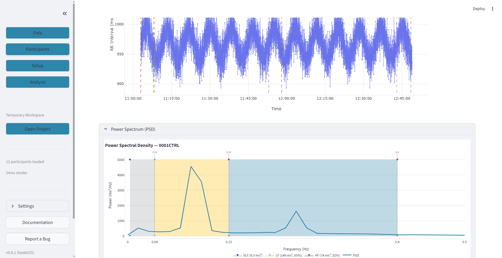

*The Power Spectral Density plot shows VLF (gray), LF (yellow), and HF (blue) frequency bands with power values and percentages. The PSD line shows the Welch-estimated power distribution.*

| Band | Frequency Range | What it reflects |
|------|----------------|-----------------|
| **VLF** | 0.003–0.04 Hz | Thermoregulation, hormonal |
| **LF** | 0.04–0.15 Hz | Both sympathetic and parasympathetic + baroreflex |
| **HF** | 0.15–0.4 Hz | Parasympathetic (vagal) activity |

!!! note
    The PSD requires at least 100 beats (300+ recommended). It uses the full (non-downsampled) RR data for accurate frequency estimation.

### 6.7 Report Export

Analysis reports can be downloaded in two formats:

| Format | What it includes |
|--------|-----------------|
| **Markdown (.md)** | Text-based report with tables — suitable for research documentation |
| **HTML** | Standalone file with professional styling, summary cards, and optionally embedded charts — suitable for sharing and printing |

For **Single Participant** analysis, reports include data source, cleaning parameters, artifact correction details, section information, and all computed HRV metrics.

For **Group Analysis**, HTML reports include participant counts, descriptive statistics tables, and individual results — all in a single self-contained file.

### 6.8 HRV Metrics Reference

| Metric | Domain | What It Tells You |
|--------|--------|-------------------|
| **RMSSD** | Time | Beat-to-beat variability — primary parasympathetic marker |
| **SDNN** | Time | Overall HRV — reflects all sources of variability |
| **pNN50** | Time | Percentage of successive intervals differing >50 ms |
| **Mean HR** | Time | Average heart rate in beats per minute |
| **LF** | Frequency | Low-frequency power (0.04-0.15 Hz) |
| **HF** | Frequency | High-frequency power (0.15-0.4 Hz) — parasympathetic |
| **LF/HF** | Frequency | Ratio — **not** "sympathovagal balance" (Quigley 2024) |
| **SD1** | Nonlinear | Short-term variability (Poincare plot) |
| **SD2** | Nonlinear | Long-term variability (Poincare plot) |

---

## Step 7: Export Results

### CSV Export

In the Analysis tab, click **"Download HRV Results (CSV)"** to export a table with:

- One row per participant per section
- All computed HRV metrics
- Quality indicators (beat count, artifact rate, grade)
- Ready for import into R, SPSS, Python, or Excel

### Ready for Analysis Export

In the Participants tab sidebar, click **"Export for Analysis"** to save a `.rrational` file containing:

- Corrected RR intervals
- Artifact indices and categories
- Quality metrics per segment
- Full audit trail (detection method, parameters, exclusion zones)

---

## Sidebar Reference

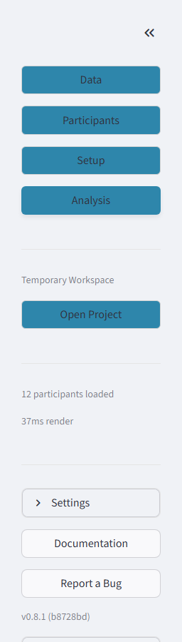

*The sidebar bottom shows: **Settings** expander, **Documentation** button (links to rrational.readthedocs.io), **Report a Bug** button (links to GitHub Issues), and the **version number** with git commit hash (e.g., "v0.8.1 (2db7ad7)").*

---

## Publication Checklist

!!! success "Required for HRV Papers (Quigley 2024)"
    - [ ] Recording device and app used
    - [ ] Recording duration per condition
    - [ ] Artifact detection method (e.g., "Lipponen & Tarvainen 2019")
    - [ ] Artifact correction method (e.g., "Kubios algorithm via NeuroKit2")
    - [ ] Artifact rate per condition (mean +/- SD)
    - [ ] Number of excluded segments and exclusion criteria
    - [ ] Beat count per condition
    - [ ] Segment duration and overlap settings
    - [ ] Which HRV metrics and why

---

## Keyboard Shortcuts

| Key | Action | Context |
|-----|--------|---------|
| `R` | Refresh/rerun app | Anywhere |
| `C` | Clear cache | Anywhere |
| `I` | Toggle inspection zoom | Signal Inspection mode |
| `Left/Right` | Pan zoomed view | Signal Inspection zoom |

---

## Troubleshooting

| Problem | Solution |
|---------|----------|
| "No data loaded" | Check files are in `data/raw/` subfolder, verify ID pattern in Import Settings |
| "Section not detected" | Map events in Setup > Events, ensure start AND end events exist |
| "No validated sections found" | Go to Participants > Section Validation, click Save |
| Slow performance | Reduce plot resolution in Settings, close browser tabs |

For installation issues, see [Installation Guide](../getting-started/installation.md#troubleshooting).
