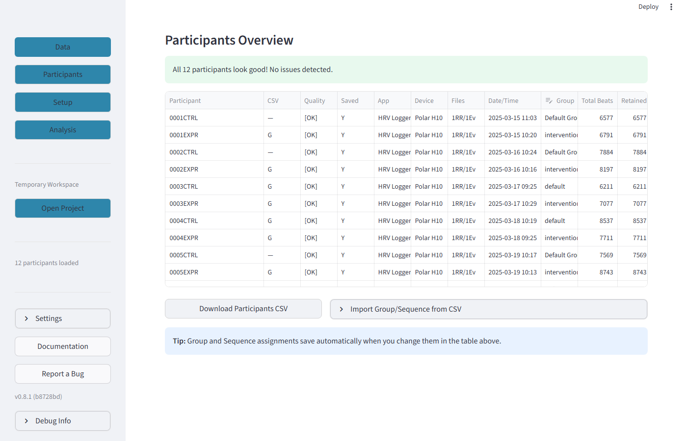
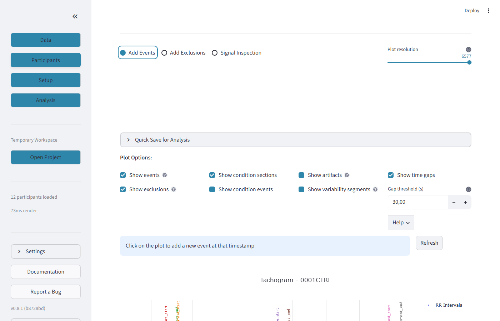

# Complete Workflow Guide

This guide walks you through every step of the RRational workflow — from opening the app to exporting publication-ready HRV results.

---

!!! success "Recommended: Scientific Workflow (Quigley 2024)"
    This workflow follows professor-reviewed best practices:

    1. **Import** → Load data and verify participant detection
    2. **Inspect** → Visual tachogram review for each participant
    3. **Segment** → Time-based segmentation (5 min windows)
    4. **Detect** → Run artifact detection on **all validated sections**
    5. **Assess** → Per-segment quality grading — exclude segments with >10% artifacts
    6. **Analyze** → HRV metrics on clean, assessed segments
    7. **Report** → Always include: beat count, artifact rate, quality grade

---

## Step 1: Launch & Create a Project

### 1.1 Start RRational

```bash
uv run streamlit run src/rrational/gui/app.py
```

The app opens at [http://localhost:8501](http://localhost:8501). You'll see the Data tab as the landing page.


*The screenshot above shows the main interface. Notice the **sidebar** on the left with four navigation buttons (Data, Participants, Setup, Analysis). Below them you can see the project indicator ("Temporary Workspace"), participant count, and at the bottom: Settings, Documentation, Report a Bug, and version info.*

### 1.2 Create a Project

On the Welcome Screen (or via "Open Project" in the sidebar), click **"Create New Project"**:

1. Click **"Browse"** → choose a folder (e.g., `Documents/HRV_Studies/`)
2. Enter a **project name** (e.g., `MyStudy`)
3. Optionally add description and author name
4. Select **data sources**: HRV Logger, VNS Analyse, or both
5. Click **"Create Project"**

Your project folder:

```
MyStudy/
├── project.rrational          # Project file (YAML)
├── data/
│   ├── raw/
│   │   ├── hrv_logger/        # Your CSV files go here
│   │   └── vns/               # Your TXT files go here
│   └── processed/             # Saved events, exports
├── config/                    # Study configuration
└── analysis/                  # Analysis results
```

!!! tip "Copy your data first"
    Copy your HRV recording files into the appropriate `data/raw/` subfolder **before** loading data in the app.

---

## Step 2: Import Data (Data Tab)

### 2.1 Load Recordings

1. In the **Data** tab, verify the **Raw data directory path** points to your project's `data/raw/` folder
2. Click **"Analyze Folder"**
3. Wait for the scan to complete

### 2.2 Review Participants Overview

After loading, the **Participants Overview** appears with a summary of all detected participants:


*Look at the table columns: **Participant** (auto-extracted ID), **Quality** ([OK] or warnings), **App** (HRV Logger or VNS Analyse), **Total Beats**, and **Duration**. This gives you an immediate overview of your dataset quality.*


*The table is interactive — you can sort by clicking column headers, and edit the **Group** column directly. The **CSV** column shows which participants have been imported from a master CSV file.*

### 2.3 Import Group Assignments (Optional)

If you have a CSV file with group/sequence assignments:

1. Click **"Import Group/Sequence from CSV"**
2. Define **value labels** for your group and sequence columns
3. Upload your CSV file
4. Map the columns (Participant ID, Group, Sequence)
5. Click **"Apply Assignments"**



---

## Step 3: Review Participants (Participants Tab)

Click **"Participants"** in the sidebar to switch to the Participants tab.

### 3.1 Participant Header

The top of the Participants tab shows participant details at a glance:


*The four metric cards give you an immediate sense of the recording quality. **Total Beats** vs **Retained** shows if any beats were removed. **Duplicates** should ideally be 0. **Duration** tells you the total recording length.*

### 3.2 Interaction Modes

Below the header, you'll see three mode buttons and the plot options:



### 3.3 Plot Options

The checkboxes control what's visible on the tachogram:


*Enable **Show artifacts** to see artifact markers and access the artifact detection tools. Enable **Show condition sections** to see repeating experimental conditions as colored background regions.*

### 3.4 The Tachogram

The tachogram is the main visualization — it shows RR intervals (milliseconds) over time:


*Key things to look for in the tachogram:*

- ***Blue line pattern***: Should show regular oscillations (respiratory sinus arrhythmia). Flat lines or sudden jumps indicate artifacts.
- ***Vertical dashed lines***: These are events (measurement start, pause, etc.)
- ***Orange dots***: Detected artifacts — ectopic beats, missed beats, or noise
- ***Overall stability***: Large changes in baseline suggest movement or position changes

---

## Step 4: Artifact Detection (Signal Inspection)

!!! info "Why artifacts matter"
    Even a small number of artifacts can dramatically distort HRV metrics. The 2024 Quigley guidelines specify maximum artifact rates for each metric type. Always detect and assess artifacts before analysis.

### 4.1 Enable Artifact Display

1. Check the **"Show artifacts"** checkbox in Plot Options
2. This reveals the **"Detect New Artifacts"** expander below the plot


### 4.2 Configure Detection

Expand **"Detect New Artifacts"** to see the detection settings:


*The key settings:*

- **Method**: "Lipponen 2019 (segmented)" is recommended — it's the current gold standard
- **Detection Scope**: Choose **"All validated sections"** to run detection separately for each study section (recommended for the scientific workflow)
- **Segment Sizing**: "Adaptive" automatically calculates optimal segment size

### 4.3 Detection Scope Options

The Detection Scope determines which part of the recording is analyzed:


*Use **"All validated sections"** for the recommended scientific workflow. This ensures the same segments are used for both artifact detection and analysis.*

### 4.4 Run Detection & Review Results

Click **"Run Detection"** and wait for the results:


!!! success "Quality Grading (Quigley 2024)"
    | Grade | Artifact Rate | Action |
    |-------|--------------|--------|
    | **Excellent** | <2% | Include as-is |
    | **Good** | 2-5% | Include, apply correction |
    | **Fair** | 5-10% | Include with caution |
    | **Poor** | >10% | **Exclude from analysis** |

### 4.5 Save Results

Click **"Save Artifact Corrections"** in the sidebar to persist your artifact detection results.

---

## Step 5: Section Validation (Participants Tab)

Scroll down in the Participants tab to find **Section Validation**:


*The validation checks that:*

- *Both start and end events exist for the participant*
- *The actual duration is within the expected tolerance*
- *The RR interval sum matches the event-based duration*


*The **Data Integrity Check** is important: it verifies that the sum of RR intervals plus gaps matches the event-based duration. Large mismatches (>1%) indicate data problems.*

### 5.1 Event Mapping

Below validation, the **Event Mapping Status** shows which expected events were found:


*Green "Found" means the event was automatically matched. Red "Missing" means you need to add the event manually or update your event synonyms in the Setup tab.*

---

## Step 6: Configure Study (Setup Tab)

Click **"Setup"** in the sidebar. The Setup tab has four sub-tabs.

### 6.1 Events

Define canonical event names and their synonyms for automatic matching:


### 6.2 Groups

Click the **"Groups"** radio button to define study groups:


### 6.3 Event Sequences

Click **"Sequences"** to define repeating condition orders:


### 6.4 Sections

Click **"Sections"** to define analysis time windows:


*Each section is defined by start/end events. You can specify multiple events (comma-separated) — the first matching event will be used.*

---

## Step 7: Analyze HRV (Analysis Tab)

Click **"Analysis"** in the sidebar.

### 7.1 Choose Analysis Mode


### 7.2 Single Participant Analysis


*The **section multiselect** defaults to all validated sections for the selected participant. You can deselect sections you want to skip.*

### 7.3 Repeating Section Analysis


### 7.4 Group Analysis


### 7.5 Understanding Results

After clicking **"Analyze HRV"**, the results include:

| Metric | Domain | What It Tells You |
|--------|--------|-------------------|
| **RMSSD** | Time | Beat-to-beat variability — primary parasympathetic marker |
| **SDNN** | Time | Overall HRV — reflects all sources of variability |
| **pNN50** | Time | Percentage of large beat-to-beat changes |
| **Mean HR** | Time | Average heart rate in beats per minute |
| **LF** | Frequency | Low-frequency power (0.04-0.15 Hz) |
| **HF** | Frequency | High-frequency power (0.15-0.4 Hz) — parasympathetic |
| **LF/HF** | Frequency | Ratio — **not** "sympathovagal balance" (Quigley 2024) |
| **SD1** | Nonlinear | Short-term variability (Poincare) |
| **SD2** | Nonlinear | Long-term variability (Poincare) |

---

## Step 8: Export & Save

### 8.1 Export for Analysis

In the Participants tab sidebar, click **"Export for Analysis"**:


### 8.2 Download CSV

In the Analysis tab, click **"Download HRV Results (CSV)"** to export:

- One row per participant per section
- All computed HRV metrics
- Quality indicators (beat count, artifact rate, grade)
- Ready for R, SPSS, Python, or Excel

---

## Sidebar Reference

The sidebar provides quick access to all navigation and tools:


---

## Publication Checklist

!!! success "Required Information for HRV Papers (Quigley 2024)"
    When reporting HRV results, always include:

    - [ ] Recording device and app used
    - [ ] Recording duration per condition
    - [ ] Artifact detection method (e.g., "Lipponen & Tarvainen 2019")
    - [ ] Artifact correction method (e.g., "Kubios algorithm via NeuroKit2")
    - [ ] Artifact rate per condition (mean +/- SD)
    - [ ] Number of excluded segments and exclusion criteria
    - [ ] Beat count per condition
    - [ ] Segment duration and overlap settings
    - [ ] Which HRV metrics and why (justify LF/HF interpretation!)

---

## Keyboard Shortcuts

| Key | Action | Context |
|-----|--------|---------|
| `R` | Refresh/rerun app | Anywhere |
| `C` | Clear cache | Anywhere |
| `I` | Toggle inspection zoom | Signal Inspection mode |
| `Left/Right` | Pan zoomed view | Signal Inspection zoom |

---

## Troubleshooting

### "No data loaded"

- Check files are in the correct `data/raw/` subfolder
- Verify filenames contain a recognizable participant ID
- Adjust the ID pattern in Import Settings

### "Section not detected"

- Check events are mapped in Setup > Events
- Verify both start AND end events exist for the participant
- Click "Save" in the sidebar after changes

### "No validated sections found"

- Go to Participants tab > Section Validation
- Ensure sections show as valid
- Click "Save" to persist validation results

### Slow performance

- Reduce plot resolution in Settings
- Close other browser tabs
- Analyze one participant at a time for large datasets

For installation issues, see [Installation Guide](../getting-started/installation.md#troubleshooting).
